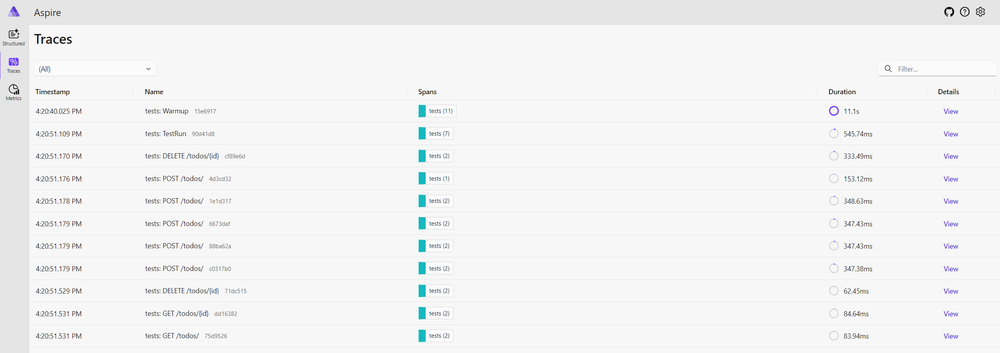
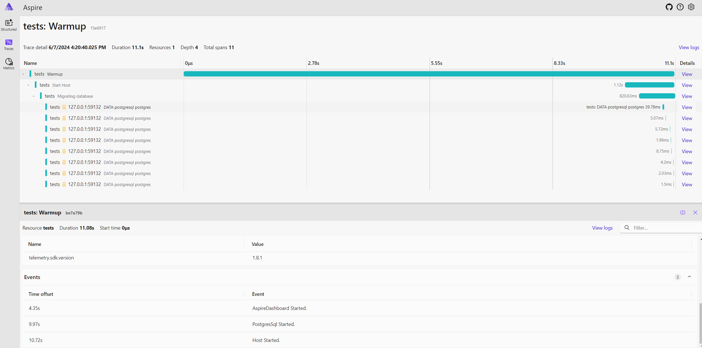
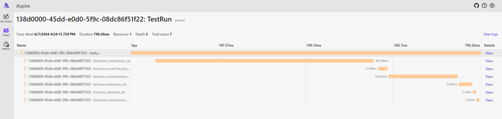
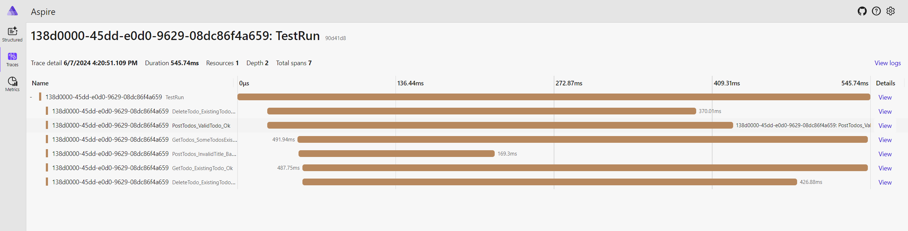
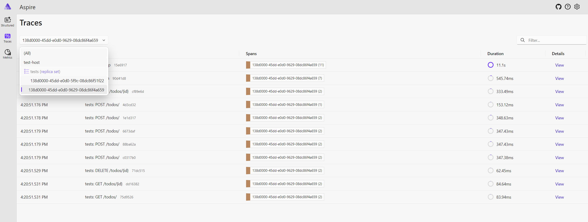

# Automated Tests Monitoring With Aspire Dashboard

Integration Tests + Alba + Aspire Dashboard + Testcontainers + Otel

This repository demonstrates how to instrument integration tests via OpenTelemetry and see the results from Aspire Dashboard.

Integration tests dependencies (PostgresSQL Database, AspireDashboard) are automatically managed as Testcontainers.

Open: <http://localhost:18888/> to see the results of Test Runs.

## Test

```bash
dotnet test --filter TodosTests --verbosity normal
# Starting test execution, please wait...
# A total of 1 test files matched the specified pattern.
# [xUnit.net 00:00:00.00] xUnit.net VSTest Adapter v2.8.1+ce9211e970 (64-bit .NET 8.0.6)
# [xUnit.net 00:00:00.17]   Discovering: Api.IntegrationTests
# [xUnit.net 00:00:00.24]   Discovered:  Api.IntegrationTests
# [xUnit.net 00:00:00.24]   Starting:    Api.IntegrationTests
# [xUnit.net 00:00:07.51]   Finished:    Api.IntegrationTests
#   Passed IntegrationTests.TodosTests.PostTodos_InvalidTitle_BadRequest(todoItem: TodoItemViewModel { Id = 205, Title = Title4cc824aa-1ec5-4c99-b210-7e5251a86876, IsComplete = True }) [139 ms]
#   Passed IntegrationTests.TodosTests.DeleteTodo_ExistingTodo_NotFound [327 ms]
#   Passed IntegrationTests.TodosTests.PostTodos_ValidTodo_Ok [359 ms]
#   Passed IntegrationTests.TodosTests.DeleteTodo_ExistingTodo_Ok(item: TodoItem { Id = 234, IsComplete = True, Title = "Title652b0e41-0d24-427a-a829-33dfa22eab88" }) [378 ms]
#   Passed IntegrationTests.TodosTests.GetTodo_ExistingTodo_Ok(item: TodoItem { Id = 198, IsComplete = True, Title = "Titlef9f1ab3a-0c0e-49ea-a94f-c008183794aa" }) [437 ms]
#   Passed IntegrationTests.TodosTests.GetTodos_SomeTodosExist_Ok(todoItemTitle: "todoItemTitle43031b1e-8d34-49a1-82e9-fc844ff505ea") [508 ms]

# Test Run Successful.
# Total tests: 6
#      Passed: 6
#  Total time: 8.3519 Seconds
```

## Demo

All traces:



Result of warmup:



Note, events denoted when each dependency has started.

Sequential test run:



Parallel test run:



💡Test Runs are separated based on  `service.instance.id` which is equivalent to `test.run_id` custom attribute and assigned based on sequential Guids.




## Reference

- <https://github.com/martinjt/unittest-with-otel/tree/main>
- <https://www.honeycomb.io/blog/monitoring-unit-tests-opentelemetry>
- <https://github.com/testcontainers/testcontainers-dotnet/tree/develop>
- <https://github.com/open-telemetry/opentelemetry-dotnet/blob/main/src/OpenTelemetry.Exporter.OpenTelemetryProtocol/README.md>
- <https://github.com/open-telemetry/opentelemetry-specification/blob/main/specification/protocol/exporter.md>
